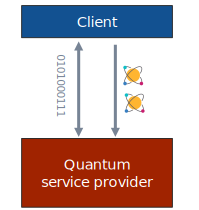
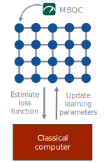

# 


# 


<br>

# Research statement

> *Towards practical quantum technologies with constrained operations and limited resources.*

 My research area is quantum information science, which is a rapidly growing field that demands interdisciplinary knowledge in quantum physics, mathematics, and computer science. This field aims to harness quantum resources such as entanglement and coherence to enhance our capabilities for computation and communication. However, to turn the theoretically blueprinted quantum advantages into practice, a deep understanding of what can and cannot be done with these resources is required, along with a systematic strategy to translate these theories into engineering products. My research focuses on addressing the critical challenges in quantum information science by exploring the capabilities and limitations of various quantum resources. I also strive to translate these theories into engineering products that can benefit both industry and society. My experience as a ```quantum researcher``` and ```software engineer``` has equipped me with a comprehensive understanding of the grand journey towards quantum industrialization. 

In the following, I will provide an overview of my research. 


## Resource benchmarks for quantum technology

 Quantum technology is believed to be much more powerful than conventional technology in many cases. One of the main drivers of its superior performance is the effective utilization of quantum resources. These resources, analogous to fuel for a car, play a critical role in all kinds of quantum technologies, such as magic states for fault-tolerant quantum computation, quantum channels for quantum communication, and quantum entanglement for quantum networking. However, these quantum resources are inherently fragile and vulnerable to noise effects induced by environmental factors, imperfect controls and unstable memories, severely compromising the accuracy, efficiency, and security of computation and communication tasks.
To address this challenge, a standard approach known as *quantum resource distillation* has emerged. This process involves transforming a large amount of noisy resource into a smaller amount of pure resource, similar to the process of reducing a dilute solution to a more concentrated one. Alongside this approach, two fundamental questions have been extensively investigated over the past two decades in the quantum community:

- How much noisy resource should we invest at least to obtain a fixed amount of pure resource?

- How much pure resource can we obtain at most from a fixed amount of noisy resource?

A deeper understanding of these questions can provide invaluable insights into the resource cost of overcoming quantum noise, benchmark state-of-the-art protocols, and ultimately remove the barriers to scaling quantum computers and quantum networks. Therefore, the main focus of my research has been on finding answers to these questions.


#### A universal law for quantum resource distillation (QIP talk[^qip])

[^qip]: QIP is the most competitive and impactful conference in quantum information science.

The celebrated no-cloning theorem[^wootters1982single] and no-deleting theorem[^Kumar_Pati_2000] similarly revealed no-go rules of information processing stemming from the basic laws of quantum mechanics and have had a profound impact on the development of quantum technologies. In the same spirit, my work [FL20-PRL][^Fang2020nogo] proposed ```the first no-go theorem for quantum resource distillation```, which universally applies to any reasonable resource theory, demonstrating that the production of any pure resource state with an arbitrarily small error is generically prohibited. We also established a quantitative trade-off between the accuracy and success probability of resource distillation, closely resembling the well-known uncertainty relation of quantum mechanics and drawing practical boundaries for quantum error processing. This work has been highlighted as an ```Editors' Suggestion in Physical Review Letters```, placing it in the top 15\% of all accepted papers, due to its particular importance, innovation, and broad appeal. Subsequently, my work [FL22-PRX Quantum][^Fang2022] expanded these results further to encompass dynamic quantum resources applicable to important areas such as quantum error correction and quantum communication.

[^wootters1982single]: W. K. Wootters and W. H. Zurek, ``A single quantum cannot be cloned,'' [*Nature*, vol. 299, pp. 802–803, 1982.](https://www.nature.com/articles/299802a0)

[^Kumar_Pati_2000]: A. K. Pati and S. L. Braunstein, ``Impossibility of deleting an unknown quantum state,'' [*Nature*, vol. 404, no. 6774, pp. 164–165, mar 2000.](https://www.nature.com/articles/35004532) 

[^Fang2020nogo]: K. Fang and Z.-W. Liu, ``No-go theorems for quantum resource purification,'' [*Physical Review Letters*, vol. 125, p. 060405, Aug 2020.](https://link.aps.org/doi/10.1103/PhysRevLett.125.060405)

[^Fang2022]: K. Fang and Z.-W. Liu, ``No-go theorems for quantum resource purification: new approach and channel theory,'' [*PRX Quantum*, vol. 3, p. 010337, Mar 2022.](https://link.aps.org/doi/10.1103/PRXQuantum.3.010337)

#### Magic state distillation for fault-tolerant quantum computing (QIP talk)

 Quantum computing requires implementing a sequence of quantum gates, which serve as the building blocks for all quantum algorithms. However, a quantum computer that uses only Clifford gates would not be more powerful than a classical computer, as per the Gottesman-Knill theorem. To construct a universal quantum computer, we need to supplement Clifford gates with a specific type of state known as *magic state*. These states are named as such because they can turn what is essentially classical into quantum, much like a magic wand. The quality of magic states is crucial to the performance of quantum computational tasks; if it is too noisy, the computational results may be inaccurate.
To address this issue, magic state distillation was introduced, and a long-standing open question in this area of research is whether we can distill a magic state using sub-logarithmic resources. Applying the no-go theorem for quantum resource distillation, my work [FL20-PRL][^Fang2020nogo] ```fully addressed this open problem``` since its initial exploration in 2005 [^bravyi2005universal] [^meier2012magic] [^bravyi2012magic] [^campbell2014enhanced] [^haah2017magic] [^haah2018codes] [^hastings2018distillation]. We proved that magic state distillation cannot be achieved with sub-logarithmic resources. This provides useful benchmarks for the resource requirements of fault-tolerant quantum computation, as the Heisenberg limit did for quantum metrology.

[^bravyi2005universal]: S. Bravyi and A. Kitaev, ``Universal quantum computation with ideal clifford gates and noisy ancillas,'' [*Physical Review A*, vol. 71, no. 2, p. 022316, 2005.](https://journals.aps.org/pra/abstract/10.1103/PhysRevA.71.022316) 

[^meier2012magic]: A. M. Meier, B. Eastin, and E. Knill, ``Magic-state distillation with the four-qubit code,'' [*arXiv preprint* arXiv:1204.4221, 2012.](https://arxiv.org/abs/1204.4221) 

[^bravyi2012magic]: S. Bravyi and J. Haah, ``Magic-state distillation with low overhead,'' [*Physical Review A*, vol. 86, no. 5, p. 052329, 2012.](https://journals.aps.org/pra/abstract/10.1103/PhysRevA.86.052329)

[^campbell2014enhanced]: E. T. Campbell, ``Enhanced fault-tolerant quantum computing in d-level systems,'' [*Physical Review Letters*, vol. 113, no. 23, p. 230501, 2014.](https://journals.aps.org/prl/abstract/10.1103/PhysRevLett.113.230501) 

[^haah2017magic]: J. Haah, M. B. Hastings, D. Poulin, and D. Wecker, ``Magic state distillation with low space overhead and optimal asymptotic input count,'' [*Quantum*, vol. 1, p. 31, 2017.](https://quantum-journal.org/papers/q-2017-10-03-31/)

[^haah2018codes]: J. Haah and M. B. Hastings, ``Codes and protocols for distilling t, controlled-s, and toffoli gates,'' [*Quantum*, vol. 2, p. 71, 2018.](https://quantum-journal.org/papers/q-2018-06-07-71/)

[^hastings2018distillation]: M. B. Hastings and J. Haah, ``Distillation with sublogarithmic overhead,'' [*Physical Review Letters*, vol. 120, no. 5, p. 050504, 2018.](https://journals.aps.org/prl/abstract/10.1103/PhysRevLett.120.050504)


#### Quantum channel coding for reliable quantum communication (3 QIP talks)

 Quantum communication is a fundamental technology in the next generation of information transmission, and also a cornerstone in building the future quantum internet. To prevent quantum data from being corrupted during transmission, senders encode their data before sending it through the channel, while receivers decode the incoming message to faithfully recover the sender's intended information. This procedure is called *quantum channel coding*, a kind of resource distillation that corrects noisy quantum channels into noiseless ones. The core issue here is to understand the optimal coding strategy and determine how much information can be reliably transmitted under such a strategy. This ultimate capability is the so-called *quantum channel capacity*, which tells us what the best coding strategy can do. Such a problem was well-studied in the classical case by Shannon in 1948, but quantum communication is much more challenging. There is a large body of literature working on the numerical evaluation of quantum channel capacity via different techniques. By exploiting the tools of quantum entropies and semidefinite programs, my works [WFD18-IEEE TIT][^wang2018semidefinite] [WFT19-IEEE TIT][^wang2019converse] [FF21-CMP][^fang2021geometric] provided ```the state-of-the-art algorithms``` (from 2017 to 2020) for estimating the capacity of a quantum channel in general. Moreover, in [WFT19-IEEE TIT][^wang2019converse], we completely determined the second-order asymptotics of the classical capacity of quantum erasure channels (an important noise model), which is of particular importance when the size of the quantum devices at the encoder and decoder is relatively small in the near term. This is also ```the first second-order expansion``` of classical capacity beyond entanglement-breaking channels and fills an important gap in the literature[^tomamichel2015second].

[^wang2018semidefinite]: X. Wang, K. Fang, and R. Duan, ``Semidefinite programming converse bounds for quantum communication,'' [*IEEE Transactions on Information Theory*, vol. 65, no. 4, pp. 2583–2592, 2018.](https://doi.org/10.1109/TIT.2018.2874031)

[^wang2019converse]: X. Wang, K. Fang, and M. Tomamichel, ``On converse bounds for classical communication over quantum
channels,'' [*IEEE Transactions on Information Theory*, vol. 65, no. 7, pp. 4609–4619, 2019.](https://doi.org/10.1109/TIT.2019.2898656) 

[^fang2021geometric]: K. Fang and H. Fawzi, ``Geometric Renyi divergence and its applications in quantum channel capacities,'' [*Communications in Mathematical Physics*, vol. 384, no. 3, pp. 1615–1677, 2021.](https://doi.org/10.1007/s00220-021-04064-4) 

[^tomamichel2015second]: M. Tomamichel and V. Y. Tan, ``Second-order asymptotics for the classical capacity of image-additive quantum channels,'' [*Communications in Mathematical Physics*, vol. 338, pp. 103–137, 2015.](https://link.springer.com/article/10.1007/s00220-015-2382-0)

#### Quantum entanglement and coherence distillation for quantum networking

 Quantum coherence and quantum entanglement are two landmark features of quantum physics. The former represents the quantumness of a single quantum system and is famously illustrated by Schrödinger's Cat, a hypothetical cat simultaneously both alive and dead. The latter represents a remarkable correlation between different quantum systems and is referred to as the ``spooky action at a distance'' by Einstein. These features serve as the key resources and building blocks for the future quantum internet, enabling exponential speed-up in quantum computation, unhackable key distribution, ultra-high precision clock synchronization, and privacy-preserving cloud services. In all these scenarios, the quality of these resources is crucial as it directly impacts the efficiency and security of the corresponding tasks. Therefore, resource distillation is used to ensure the quality of these resources before their actual usage.
A major concern here is to understand the maximal amount of pure entanglement or coherence that can be extracted from a fixed amount of noisy resources. Using the techniques of semidefinite optimization, my work [FWTD19-IEEE TIT][^fang2019non] introduced efficiently computable frameworks for estimating the transformation rate of distilling quantum entanglement and initiated ```the first second-order analysis``` of this task under practical noise and operations. Similarly, in [HFW21-IEEE TIT][^hayashi2021finite], we have also made significant contributions by initiating ```the first second-order analysis``` on coherence distillation and establishing a precise connection between coherence distillation and randomness extraction in quantum cryptography.
Another set of works [FWLRA18-PRL][^fang2018] [RFWA18-PRL][^regula2018] [RFWG19-NJP][^regula2019one] [DFWRSCW18-Quantum][^Diaz2018usingreusing] provided quantitative analysis on the operational power of different classes of operations for distilling quantum entanglement and quantum coherence. These series of works have made groundbreaking contributions to understanding critical quantum resources in quantum networks and have attracted ```widespread attention``` in the community (with over 350 citations to date) and have been successfully utilized as ```benchmarks in experiments```[^xiong2021experimental].


[^fang2019non]: K. Fang, X. Wang, M. Tomamichel, and R. Duan, ``Non-asymptotic entanglement distillation,'' [*IEEE Transactions on Information Theory*, vol. 65, no. 10, pp. 6454–6465, 2019.](https://doi.org/10.1109/TIT.2019.2914688)

[^hayashi2021finite]: M. Hayashi, K. Fang, and K. Wang, ``Finite block length analysis on quantum coherence distillation and incoherent randomness extraction,'' [*IEEE Transactions on Information Theory*, vol. 67, no. 6, pp. 3926–3944, 2021.](https://doi.org/10.1109/TIT.2021.3064009)

[^fang2018]: K. Fang, X. Wang, L. Lami, B. Regula, and G. Adesso, ``Probabilistic distillation of quantum coherence,'' [*Physical Review Letters*, vol. 121, p. 070404, Aug 2018.](https://link.aps.org/doi/10.1103/PhysRevLett.121.070404) 

[^regula2018]: B. Regula, K. Fang, X. Wang, and G. Adesso, ``One-shot coherence distillation,'' [*Physical Review Letters*, vol. 121, p. 010401, Jul 2018.](https://link.aps.org/doi/10.1103/PhysRevLett.121.010401) 

[^regula2019one]: B. Regula, K. Fang, X. Wang, and M. Gu, ``One-shot entanglement distillation beyond local operations and
classical communication,'' [*New Journal of Physics*, vol. 21, no. 10, p. 103017, 2019.](https://doi.org/10.1088/1367-2630/ab4732) 

[^Diaz2018usingreusing]: M. G. D ́ıaz, K. Fang, X. Wang, M. Rosati, M. Skotiniotis, J. Calsamiglia, and A. Winter, ``Using and reusing coherence to realize quantum processes,'' [*Quantum*, vol. 2, p. 100, Oct. 2018.](https://doi.org/10.22331/q-2018-10-19-100)

[^xiong2021experimental]: S.-J. Xiong, Z. Sun, Q.-P. Su, Z.-J. Xi, L. Yu, J.-S. Jin, J.-M. Liu, F. Nori, and C.-P. Yang, ``Experimental demonstration of one-shot coherence distillation: realizing n-dimensional strictly incoherent operations,'' [*Optica*, vol. 8, no. 7, pp. 1003–1008, 2021.](https://doi.org/10.1364/OPTICA.427800)


## Mathematical tools for quantum information processing

The development of quantum information science often accompanies by a more thorough understanding of
the mathematical framework underlying it. Of particular relevance are quantum entropies and optimization theories, which serve as valuable tools for analyzing quantum information processing.

#### Quantum relative entropy in quantum data discrimination (QIP talk)

Quantum relative entropies serve as quantum generalizations of the widely used Kullback-Leibler divergence, providing a measure to quantify the distinguishability between different quantum data. My works [FF21-CMP][^fang2021geometric] [FFRS20-PRL][^Fang2020] proved the chain rule properties of two major variants of quantum relative entropies, namely the Belavkin-Staszewski relative entropy and the Umegaki relative entropy. These results have established a crucial relationship between the entropy of a large quantum system and its individual subsystems, greatly generalizing the widely used quantum data processing inequalities. Remarkably, in [FF21-CMP][^fang2021geometric], we ```addressed a critical open question``` raised by Wilde et al. in [^wilde2020amortized] and provided ```the first sequence of quantum applications``` of the Belavkin-Staszewski relative entropy, sparking the community's interest in this previously neglected quantity. As a result, numerous follow-up works have emerged in various domains, including quantum metrology[^yang2020communication], quantum machine learning[^li2022concentration], and even quantum field theory[^hollands2023complexity]. Furthermore, in [FFRS20-PRL][^Fang2020], we ```solved an open question``` in the area of quantum channel discrimination[^wilde2019open]: namely, adaptive and non-adaptive discrimination strategies have exactly the same power in the asymmetric discrimination of quantum channels, negating the widely held ``mistaken intuition'' that adaptive strategies have more discrimination power.

[^Fang2020]: K. Fang, O. Fawzi, R. Renner, and D. Sutter, ``Chain rule for the quantum relative entropy,'' [*Physical Review Letters*, vol. 124, p. 100501, Mar 2020.](https://link.aps.org/doi/10.1103/PhysRevLett.124.100501) 

[^wilde2020amortized]: M. M. Wilde, M. Berta, C. Hirche, and E. Kaur, ``Amortized channel divergence for asymptotic quantum
channel discrimination,'' [*Letters in Mathematical Physics*, vol. 110, pp. 2277–2336, 2020.](https://doi.org/10.1007/s11005-020-01297-7) 

[^yang2020communication]: Y. Yang, G. Chiribella, and M. Hayashi, ``Communication cost of quantum processes,'' [*IEEE Journal on Selected Areas in Information Theory*, vol. 1, no. 2, pp. 387–400, 2020.](https://doi.org/10.1109/JSAIT.2020.3016061) 

[^li2022concentration]: G. Li, R. Ye, X. Zhao, and X. Wang, ``Concentration of data encoding in parameterized quantum circuits,'' [*arXiv preprint* arXiv:2206.08273, 2022.](https://doi.org/10.48550/arXiv.2206.08273)

[^hollands2023complexity]: S. Hollands and A. Ranallo, ``Complexity in algebraic QFT,'' [*arXiv preprint* arXiv:2302.10013, 2023.](https://doi.org/10.48550/arXiv.2302.10013) 

[^wilde2019open]: M. M. Wilde, ``[Open problems session at the banff workshop about algebraic and statistical ways into quantum resource theories](https://www.birs.ca/workshops/2019/19w5120/files/%2019w5120-OpenProblems-20190723.mp4),'' 2019


#### Polynomial optimization and quantum entanglement verification

 The sum-of-squares (SOS) hierarchy is a series of increasingly tight relaxations of polynomial optimization problems and has profound impact in various fields, including control theory, statistics,
and quantum information. Despite extensive research, the rate of convergence of the SOS hierarchy has yet to be fully understood[^klerk2019survey]. Exploiting the polynomial kernel technique, my work [FF21-MP][^fang2021sum] provided ```the first quadratic improvement``` of the best-known convergence rate of the SOS hierarchy on the sphere since 1995[^reznick1995uniform], ```solving an important open problem``` in the optimization field[^de2022convergence] and catalyzing subsequent breakthroughs on related topics [^slot2022sum] [^slot2022sum2]. Furthermore, we established ```the first strict duality relationship``` between the SOS hierarchy and the well-known Doherty-Parrilo-Spedalieri (DPS) hierarchy in quantum theory for quantum entanglement verification, thereby solidifying the connection between optimization theory and quantum information.

[^klerk2019survey]: E. de Klerk and M. Laurent, ``A survey of semidefinite programming approaches to the generalized problem of moments and their error analysis,'' [*in World Women in Mathematics 2018: Proceedings of the First World Meeting for Women in Mathematics (WM).* Springer, 2019, pp. 17–56.](https://doi.org/10.1007/978-3-030-21170-7_1) 

[^fang2021sum]: K. Fang and H. Fawzi, ``The sum-of-squares hierarchy on the sphere and applications in quantum information
theory,'' [*Mathematical Programming*, vol. 190, no. 1, pp. 331–360, 2021.](https://doi.org/10.1007/s10107-020-01537-7)

[^reznick1995uniform]: B. Reznick, ``Uniform denominators in Hilbert’s seventeenth problem,'' [*Mathematische Zeitschrift*, vol. 220, no. 1, pp. 75–97, 1995.](https://doi.org/10.1007/BF02572604)

[^de2022convergence]: E. de Klerk and M. Laurent, ``Convergence analysis of a lasserre hierarchy of upper bounds for polynomial minimization on the sphere,'' [*Mathematical Programming*, vol. 193, no. 2, pp. 665–685, 2022.](https://doi.org/10.1007/s10107-019-01465-1) 

[^slot2022sum]: L. Slot and M. Laurent, ``Sum-of-squares hierarchies for binary polynomial optimization,'' [*Mathematical Programming*, pp. 1–40, 2022.](https://doi.org/10.1007/s10107-021-01745-9)

[^slot2022sum2]: L. Slot, ``Sum-of-Squares Hierarchies for Polynomial Optimization and the Christoffel–Darboux Kernel,'' [*SIAM Journal on Optimization*, vol. 32, no. 4, pp. 2612–2635, 2022.](https://doi.org/10.1137/21M1458338)


## Quantum software engineering for quantum internet

Quantum information science is a practical field that aims to solve real-world problems. This requires hardware engineering to actually build the quantum system and software engineering to control hardware devices so as to run useful quantum algorithms. My focus is on the software aspect that runs on top of hardware devices and supports higher-level quantum applications. To fully tap into the unique features of quantum systems, quantum software must align with the principles of quantum physics and be optimized to a high degree, requiring expertise in both quantum information and software engineering. During my work at Baidu, I have successfully led multiple industrial projects that work coherently with the Baidu Quantum Platform, a full-stack quantum software and hardware platform developed by Baidu[^BQP].

[^BQP]: Official website at [https://quantum.baidu.com](https://quantum.baidu.com)


#### Efficient testbed for quantum internet 

 Quantum internet is essentially a distributed network of quantum computers and devices. Such a network has the potential to surpass its classical counterpart in various aspects, including the efficiency of data transmission, the security of network services, and the capability of information processing. To accelerate research and development on quantum networks, we have developed QNET [^QNET], an open-source software toolkit implemented in Python. It serves as a core component of the Baidu Quantum Platform and is ```the first quantum network toolkit``` that interfaces with real-world quantum computers. QNET is built upon a solid foundation of ```over 40 patent applications```. The latest version, 1.4.0, comprises over 40 core modules, a vast repository of 25,000 lines of open-source code, 28 tutorials in both English and Chinese, a comprehensive API document, and a detailed white paper [FZLLD23-SCIS][^fang2022quantum]. The modular design of this toolkit provides flexibility for testing different quantum network architectures. In particular, we conducted a fine-grained simulation of a quantum key distribution experiment on the renowned Micius quantum satellite[^liao2017satellite], which demonstrated remarkable consistency with actual experimental data and underscored the effectiveness of QNET as a valuable testbed for future experiments. This toolkit has been presented at 2022 Baidu Create[^Baidu_Create] and ```reported by the mainstream news media in China``` at PingWest[^PingWest], Toutiao[^Toutiao], QbitAI[^QbitAI], among others.


[^fang2022quantum]: K. Fang, J. Zhao, X. Li, Y. Li, and R. Duan, ``Quantum NETwork: from theory to practice,'' [*Science China Information Sciences*, vol. 66, no. 8, p. 180509, 2023.](https://doi.org/10.1007/s11432-023-3773-4)

[^QNET]: Official website at [https://quantum-hub.baidu.com/qnet/](https://quantum-hub.baidu.com/qnet/), Source code available at [https://github.com/baidu/QCompute/tree/master/Extensions/QuantumNetwork](https://github.com/baidu/QCompute/tree/master/Extensions/QuantumNetwork)

[^liao2017satellite]: S.-K. Liao, W.-Q. Cai, W.-Y. Liu, L. Zhang, Y. Li, J.-G. Ren, J. Yin, Q. Shen, Y. Cao, Z.-P. Li et al., ``Satellite-to-ground quantum key distribution,'' [*Nature*, vol. 549, no. 7670, pp. 43–47, 2017.](https://www.nature.com/articles/nature23655)

[^Baidu_Create]: Baidu Create AI Developer Conference is an annual event featuring Baidu's latest technological advances.
Source at [https://www.youtube.com/live/LlydjVDYb3A?feature=share&t=5909](https://www.youtube.com/live/LlydjVDYb3A?feature=share&t=5909)

[^PingWest]: Source at [https://en.pingwest.com/a/10696](https://en.pingwest.com/a/10696)

[^Toutiao]: Source at [https://www.toutiao.com/article/7137927453540237838?&source=m_redirect](https://www.toutiao.com/article/7137927453540237838?&source=m_redirect)

[^QbitAI]: Source at [https://mp.weixin.qq.com/s/6jfh_MMypbqHq3KlhYiTew](https://mp.weixin.qq.com/s/6jfh_MMypbqHq3KlhYiTew)


#### Privacy-preserving quantum cloud service

 Consider a scenario in which a client seeks to run a quantum algorithm to solve a problem but lacks access to a quantum computer. In such a situation, the client might opt to utilize a quantum cloud service provided by a company. However, there may be concerns regarding entrusting the service provider with the confidentiality of the client's algorithm and data.
The blind quantum computation protocol offers a solution that empowers clients to leverage cloud services while safeguarding their privacy. Nonetheless, the protocol is intricate, necessitating interactive, real-time communication between the client and the server. It also involves the back-and-forth translation of the quantum circuit model to the measurement-based model.
In this project[^BQC], we provided ```the first engineering implementation``` of the universal blind quantum computation protocol since its proposal in 2009[^broadbent2009universal]. Our implementation automatically translates a user's quantum circuit algorithm into the brickwork pattern and processes the computation interactively and in real-time between the user's local PC and the cloud server. This project brings the remarkable privacy-preserving quantum computing scheme into practice and ```paves the way for its realization``` with actual quantum computers. 


[^BQC]: Official website at [https://quantum-hub.baidu.com/bqc/tutorial-bqc](https://quantum-hub.baidu.com/bqc/tutorial-bqc)

[^broadbent2009universal]: A. Broadbent, J. Fitzsimons, and E. Kashefi, ``Universal blind quantum computation,'' [*in 2009 50th Annual IEEE Symposium on Foundations of Computer Science.* IEEE, 2009, pp. 517–526.](https://doi.org/10.1109/FOCS.2009.36)


#### New avenue for quantum machine learning

 Quantum machine learning is a burgeoning field that seeks to harness the computational power of quantum computers for more efficient problem-solving. In this approach, we reconfigure our problem into a quantum algorithm, integrating learning parameters, and employ a quantum computer to assess the loss function. Subsequently, classical computers aid in iteratively adjusting the algorithm's parameters until a solution is attained. The predominant model for quantum computing is the quantum circuit model, which entails a sequence of quantum gate operations followed by the measurement of the final state. However, an alternative model known as measurement-based quantum computation (MBQC) exists. It relies on measurements of a highly entangled quantum state to propel computation, proving particularly well-suited for photonic quantum systems and exhibiting enhanced resilience to noise.
As a part of Paddle Quantum, a quantum machine learning toolkit, our project[^MBQC] concentrates on the development of an efficient MBQC simulator and a transpiler that converts quantum circuits into their MBQC equivalents.  This advancement marks ```the first implementation``` of quantum machine learning within this unique computational framework, opening new avenues for exploring quantum machine learning and enabling delegated quantum machine learning with privacy. 
This approach was ```later followed``` by Xanadu[^xanadu], a pioneering quantum startup, as well as other university groups from Yale and Oxford[^evans2022mcbeth] [^sunami2022graphix].

[^MBQC]: Official website at [https://qml.baidu.com/tutorials/measurement-based-quantum-computation/measurement-based-quantum-computation-module.html](https://qml.baidu.com/tutorials/measurement-based-quantum-computation/measurement-based-quantum-computation-module.html), Source code available at [https://github.com/PaddlePaddle/Quantum/tree/master/paddle_quantum/mbqc](https://github.com/PaddlePaddle/Quantum/tree/master/paddle_quantum/mbqc)

[^xanadu]: Source at [https://pennylane.ai/qml/demos/tutorial_mbqc/](https://pennylane.ai/qml/demos/tutorial_mbqc/)

[^evans2022mcbeth]: A. Evans, S. Omonije, R. Soule, and R. Rand, ``MCBeth: A Measurement Based Quantum Programming Language,'' [*arXiv preprint* arXiv:2204.10784, 2022.](https://doi.org/10.48550/arXiv.2204.10784) 

[^sunami2022graphix]: S. Sunami and M. Fukushima, ``Graphix: optimizing and simulating measurement-based quantum computation on local-clifford decorated graph,'' [*arXiv preprint* arXiv:2212.11975, 2022.](https://doi.org/10.48550/arXiv.2212.11975)


<br>

## References


